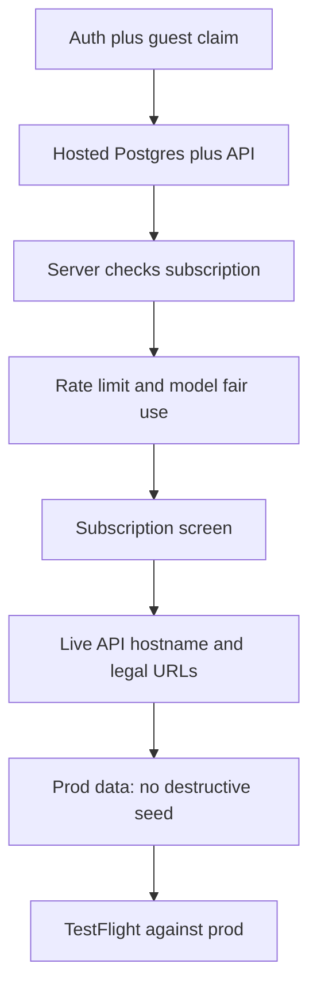

# Production readiness

Dated snapshot: **17 Sep 2026**. Product shape is treated as settled: taste → paywall → compose → private library → community Home. This file is only **what is still fake, local, or shared** so a stranger cannot use it as a real service.

[`BUILD.md`](../BUILD.md) stays the feature tracker. Next product row is still **8. Auth**.

**Verdict: the app is a working local demo, not a production service.** One iPhone against Docker Postgres can cook, pay in sandbox, save, and browse Home. A second person, a second phone, or a public API URL would share one user, one library, and an unmetered LLM bill.

---

## What already works (keep)

These are the product. They do not need reinventing for launch.

| Area | Status |
| --- | --- |
| Compose + decision + four styles + recook | Done. Overlay talks to `POST /reframe`. |
| Taste once, then hard paywall | Done. StoreKit 2 annual `$39.99` / monthly `$4.99`. Restore exists on paywall and taste. |
| Private library | Done *as a single-user loop*. Save, heart per style, delete, public/private, Original. |
| Community Home | Done. Faceted feed, style tabs, pull-to-refresh, viewer hearts. |
| Profile chrome | Done. Identity header, Favorites + four style tabs, Settings gear. |
| Safety on cook | Done. Unsafe thoughts `continue` with 988; no reframe. Thought text is not logged. |
| Local backend | Done. Docker Postgres 5433, Drizzle, `/health`, Dockerfile, ~114 Vitest cases. |

Stale copy: [`README.md`](../README.md) and [`AGENTS.md`](../AGENTS.md) still say Home is postponed. The binary has Home. Ignore those sentences.

---

## What is missing (functional)

Ranked by “would this break for a real user or a real bill.”

### 1. There is only one user — blocking

Every API call is the seeded UUID `00000000-0000-4000-8000-000000000001`.

```ts
// backend/src/lib/authStub.ts
export function getOwnerUserId(): string {
  return DEV_USER_ID;
}
```

The middleware is a no-op. iOS sends no `Authorization` header (`APIClient.swift`). Profile is hardcoded **JM** / “Josip Miljak” (`CircleIcon.swift`). Settings **Log out** only clears a local StoreKit session flag; it does not switch accounts.

**If you point production at this API:**

- Everyone reads and writes the same library.
- Everyone’s Home hearts are the same viewer.
- Public/private is meaningless (you are always the owner of “your” cards and never of anyone else’s, except the seed users).
- A second iPhone with Restore unlocks Home via Apple, then loads **Joe’s cards**, not a blank account.

**Needed (BUILD.md row 8):**

- Sign in with Apple + Better Auth on Postgres.
- iOS attaches the session on every request.
- Guest taste card **claimed** onto the new user after Subscribe / Restore, so the first cook is not orphaned.
- `users` grows past `id` + `initials` (Apple subject, `tasteCompletedAt`, display name).
- Profile uses the real name/initials.
- Settings Sign in / Log out is a real session and still does not cancel Apple.

Until this exists, do not expose the API.

### 2. There is no production host — blocking

| Piece | Today |
| --- | --- |
| Railway | No Angles project (account has biteandstride, ideon, Appsail). |
| Release URL | Placeholder `https://api.angles.app` in [`AppConfig.swift`](../AnglesApp/AnglesApp/Config/AppConfig.swift). That host is not this app. `angles.app` is someone else’s camera waitlist. |
| Debug URL | Hardcoded LAN IP `http://192.168.0.39:8787`. Breaks when the Mac’s IP changes. |
| TLS | Only whatever Railway (or similar) would terminate. App has no prod origin. |
| Migrate | `assertSchemaCurrent()` **fails boot** if schema is behind. Image `CMD` is `node dist/index.js` — it does **not** migrate. |
| Secrets | Local `.env` only. Prod needs `DATABASE_URL`, `MISTRAL_API_KEY`, optional Gemini/DeepSeek, later `BETTER_AUTH_*`. |

**Needed:**

- Postgres + API on Railway (or equivalent). Health check `/health`.
- A hostname **you** control for the API. Put it in Release `AppConfig`.
- Run `pnpm db:migrate` as a release step, not by hand on Joe’s laptop.
- Debug URL from a single config/env, not a committed LAN IP.

### 3. The paywall does not protect the API — blocking

Unlock is **client-only**. StoreKit decides whether the iOS chrome shows Home. `POST /reframe` and `POST /cards` do not check a subscription.

Once the URL is public:

- Unpaid clients, curl, or a cloned binary cook for free.
- Taste-once is an iOS flag (`hasCompletedOnboardingTaste`), not a server quota.

Restore already works for **this phone’s** Apple ID. It does not mint a backend user or attach an entitlement to one.

**Needed, with Auth:**

- Server verifies the Apple subscription (App Store Server API / signed transaction) before `/reframe`.
- Taste is one free cook **per account** (or per Apple ID), not per install.
- Expired / refunded / revoked → API refuses cooks; iOS already sends them to the paywall.

### 4. LLM cost is uncapped — blocking for a public URL

No HTTP rate limit. Guards today: 8 KiB body, 2000-char text, 6 follow-ups, 10s cook, 3 in-flight provider calls. Those stop accidents, not a loop.

The compose picker offers **Mistral, Gemini, and DeepSeek** to every entitled client. [`docs/subscription-tiers.md`](subscription-tiers.md) says the cheap SKU is Mistral-only and plans a soft **20 ready cooks / day** (later a credits ledger). **None of that is implemented.**

Company spend caps in Mistral / Google / DeepSeek consoles are also unset from this repo.

**Needed before the API is public:**

- Rate limit per user (and a tight anonymous/IP limit until Auth exists — better: no public API until Auth).
- Fair-use cap or credits; recook counts; continues can stay free.
- Default model only on `$4.99`, or charge Gemini/DeepSeek more.
- Provider monthly caps so a leaked key cannot run an unbounded bill.
- Parse provider `usage` and store millicents **without** thought text (tiers memo). After Auth.

### 5. Subscription Settings is a stub — product hole

Settings → Subscription opens `DrawerStubView("Coming later")`. Status label (Subscribed / Inactive) is real. There is no:

- Restore purchases (only paywall (i) and taste)
- Manage / cancel (App Store subscriptions sheet)
- Plan name, renewal, or “you’re on Yearly”

A paying user who is already in the app has no place to restore on a new phone except the taste link, which they will not see if StoreKit already unlocked them.

**Needed:** a real Subscription screen: status, plan, Restore, Manage. Log out stays a session reset and does not cancel Apple.

### 6. Cross-device and reinstall — follows from Auth

StoreKit entitlement **does** follow the Apple ID to a new iPhone (Restore / `currentEntitlements`). The library **does not**. Cards live in Postgres keyed by the stub user, or after Auth by whatever account you create.

Without guest claim:

- Taste Save writes a card as whoever the API thinks is the owner (today: JM).
- Subscribe creates (or should create) a real user — that card is not automatically theirs unless you claim it.

With Auth and claim: new phone → Restore or Sign in with Apple → same library. That is the actual “subscription works on my devices” behavior.

### 7. Community data is a fixture — launch hygiene

`pnpm db:seed-community` loads 50 fake people / 330 public posts and **deletes every non-DEV user**. Fine for Joe’s phone. Lethal on production.

Home with only seed content is a demo feed. Real Home is empty until people publish, or you keep a small curated seed **once** and never run the destructive script again.

There is no report/block. You said the product is fine as-is; this is not a “must hide Home” note. It is: the first week of a public feed will collect junk, and you have no in-app way to take a post down except owner delete / DB. If you are the only moderator, a SQL/admin path is enough to start. If you are not, you will want report + hide.

### 8. Dead buttons and wrong domain — polish that is still functional

Paywall (i) **Terms of Service** and **Privacy Policy** go to `https://angles.app/terms` and `/privacy`. Those **404**. The root site is a different product. Tapping them does nothing useful.

**Needed:** a domain you own, two live pages, those two URLs updated. Support email on the same site. Not a guideline lecture — the links are broken.

### 9. Ops that keep it up

| Gap | Why it matters |
| --- | --- |
| Image does not migrate | New deploy with a new Drizzle revision crash-loops until someone migrates. |
| No CI | `pnpm test` / `typecheck` are laptop-only. Easy to ship a red schema. |
| No crash reporter | TestFlight / prod failures are invisible unless someone screenshots. Optional if you watch Railway logs. |
| No cook metrics | You cannot see p50 cooks/user without logging thought text. Count `POST /reframe` by user/model/status only. |
| Lottie is the only extra SDK | Fine. Keep keys off the device. |

---

## Order of work

Do not parallelize 1–3. A hosted API without Auth and quota is worse than staying local.



1. **Auth + claim** — real users, session header, taste card follows Subscribe/Restore, Profile name, Settings session. Still talk to local Docker while this lands.
2. **Host** — Railway Postgres + API, migrate on release, secrets, `/health`.
3. **Gate `/reframe`** — no cook without a live Apple entitlement tied to that user. Taste = one server-side free cook.
4. **Cap spend** — per-user fair use; lock Gemini/DeepSeek; provider console caps.
5. **Subscription Settings** — restore, manage, plan. Kill “Coming later.”
6. **Hostname you control** — Release `AppConfig`, paywall legal URLs that load.
7. **Prod data** — empty or curated Home; never `db:seed-community` against prod.
8. **TestFlight** on the production API + sandbox IAP, then a real archive.

Credits/millicents from the tiers memo wait until Auth exists. Unlimited Mistral under a daily cap is enough for v1.

---

## Scoreboard

| Capability | Demo today | Production |
| --- | --- | --- |
| Cook four styles | Yes | Yes, after gate + cap |
| Paywall / Restore on this phone | Yes (sandbox) | Yes, plus server check |
| My library | Yes, as JM | Only after Auth |
| Home feed | Yes, mostly seed | Real users; don’t wipe them |
| Second iPhone | Unlocks, shows JM’s data | Same Apple ID → same account |
| Unpaid `/reframe` | Always allowed | Must refuse |
| Gemini for $4.99 | Allowed | Must not be unbounded |
| Settings → Subscription | “Coming later” | Real screen |
| API URL | LAN IP / fake `api.angles.app` | Your host |

---

## File index

| What | Where |
| --- | --- |
| Auth stub | [`backend/src/lib/authStub.ts`](../backend/src/lib/authStub.ts) |
| Missing `Authorization` | [`APIClient.swift`](../AnglesApp/AnglesApp/Networking/APIClient.swift) |
| Release / debug URLs | [`AppConfig.swift`](../AnglesApp/AnglesApp/Config/AppConfig.swift) |
| StoreKit (client only) | [`StoreKitManager.swift`](../AnglesApp/AnglesApp/StoreKit/StoreKitManager.swift) |
| Subscription stub | [`SettingsView.swift`](../AnglesApp/AnglesApp/Settings/SettingsView.swift), [`DrawerStubView.swift`](../AnglesApp/AnglesApp/Home/DrawerStubView.swift) |
| JM placeholder | [`CircleIcon.swift`](../AnglesApp/AnglesApp/Theme/CircleIcon.swift) |
| Users schema | [`backend/src/db/schema.ts`](../backend/src/db/schema.ts) |
| Deploy image | [`backend/Dockerfile`](../backend/Dockerfile) |
| Env template | [`backend/.env.example`](../backend/.env.example) |
| Destructive seed | [`backend/src/scripts/seedCommunity.ts`](../backend/src/scripts/seedCommunity.ts) |
| Cost plan (not built) | [`docs/subscription-tiers.md`](subscription-tiers.md) |
| Auth product spec | [`docs/onboarding-and-signup-flow.md`](onboarding-and-signup-flow.md) |
