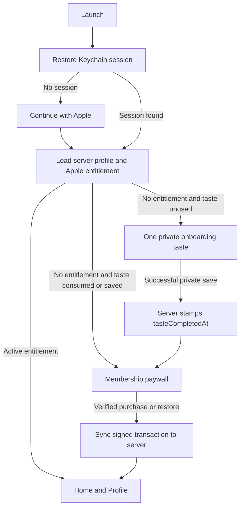

# Onboarding and signup flow

Current shipped flow for authentication, the onboarding taste, subscription gating, and credits.

## Principles

- **Sign in first.** Continue with Apple is the only account entry point. There is no email/password or anonymous account mode.
- **One taste per Angles account.** The backend stamps `users.tasteConsumedAt` when the first taste reaches a ready result; reinstalling the app or changing devices does not create another taste for the same account.
- **The taste is real and private.** It runs the normal server reframe flow. Saving the active result succeeds as a private card and separately stamps `tasteCompletedAt` in the same server transaction.
- **The paywall follows the saved taste.** The taste cannot be dismissed or recooked. A successful private save transitions to the annual/monthly paywall.
- **Entitlement and credits are server-owned.** StoreKit supplies signed purchase data; the backend verifies and binds the subscription to the signed-in Angles account. Paid accounts receive 600 credits per monthly membership period.

## Gate order

The app waits for both session restoration and StoreKit state before publishing a destination, so login, taste, paywall, and Home do not flash through each other.

## First account

1. Launch shows **Continue with Apple**.
2. The app sends the Apple identity token to Better Auth, stores the bearer token in Keychain, and loads `GET /profile/session`.
3. StoreKit checks live entitlements for that account.
4. If the account is not entitled and both taste timestamps are empty, the app opens the normal compose experience as the onboarding taste.
5. The taste may include decision follow-ups. Only Mistral is available, and server abuse limits bound the number of taste turns.
6. The ready card's Save is forced private. `POST /cards` stores it for the signed-in user and stamps `tasteCompletedAt`.
7. The app presents the paywall. Annual is `$39.99/year`; monthly is `$4.99/month`; there is no free trial.
8. A verified purchase is created with the Angles account UUID as `appAccountToken`, synced to the backend, and then opens Home.

If the app is killed after the server returned a ready taste but before the card saves, `tasteConsumedAt` still routes the next launch to the paywall. The already-visible in-memory ready card remains saveable until that app session ends.

## Returning accounts

- Active Apple entitlement: sync/refresh and enter Home.
- Taste completed but no active entitlement: show the paywall.
- Taste incomplete and no active entitlement: show the taste.
- Restore purchases checks Apple, verifies the signed transaction, and binds it to the current Angles account. A transaction already owned by another Angles account is rejected.
- Expired membership stays at Renew/Switch. Cancellation leaves access active until Apple's paid-through date.
- Logging out clears the local session and returns to Continue with Apple; it does not cancel the Apple subscription.
- Deleting the account removes the Angles account and its server data; it does not cancel the Apple subscription.

## Paid usage

Both monthly and annual subscriptions grant **600 credits for each monthly membership period**:

- Mistral ready result: 1 credit
- DeepSeek ready result: 2 credits
- Gemini ready result: 6 credits
- Continue, safety response, or failed operation: 0 user credits

The backend reserves the selected model's tariff before provider work and charges only a ready result. The app keeps all three models visible, disables unavailable choices, and moves an unaffordable selection to the cheapest allowed model. Credits do not roll over and there are no packs or overages.

## App Review

The core experience requires Sign in with Apple because the taste limit, private card ownership, subscription entitlement, credits, reporting/blocking, and account deletion are account-scoped server features. This is not an anonymous trial.

Do not supply shared demo credentials and do not tell reviewers that sign-in is optional. The reviewer should use **Continue with Apple** and an Apple sandbox purchase. The exact path is in `docs/app-review-notes.md`.
