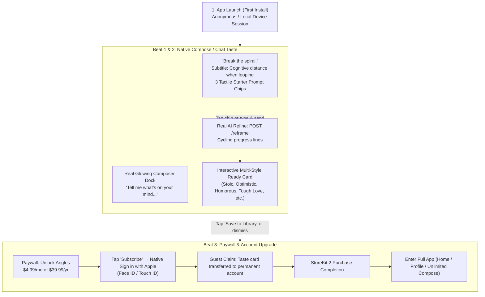

# Onboarding & Signup Architecture

How Angles handles first-run onboarding, subscription gating, and authentication, adapted from the pattern used in Bite & Stride.

---

## 1. Core Principles

1. **Zero Profiling Survey**: Unlike health/fitness apps that require personal profiling (e.g. weight, height, activity level), reframing thoughts needs no demographic questions. The user enters directly into the core experience.
2. **Immediate "Taste" (Beat 1 & 2)**: The user experiences the product's value (all 4 reframed angles) on their own thought or a curated starter prompt within 30 seconds of install.
3. **Lazy Account Registration at Paywall (Beat 3)**: Authentication does not happen on launch. It is triggered only when the user decides to subscribe or save their reframe into their permanent library.
4. **No Email + Password in Production**: 100% native **Sign in with Apple** on iOS. No passwords, no password reset emails, no email verification friction.
5. **Apple App Store Review Immunity**: Because the app is not locked behind a login gate at launch, Apple reviewers never require demo credentials.

---

## 2. The Three-Beat Onboarding Flow

### Beat 1: The Hook & Chat Interface
- **Look & Feel**: 100% native Compose sheet matching the real paying app (charcoal frosted glass, glowing composer bar).
- **Header**:
  - Sparkle emblem with accent tint.
  - Title: *"Break the spiral."*
  - Subtitle: *"When your mind gets stuck looping on a thought, Angles reframes it from unexpected perspectives so you can unhook and move forward."*
- **Action Elements**:
  - Three tactile starter prompt chips for instant zero-typing testing:
    1. *"I am constantly falling behind."*
    2. *"I can't stop overthinking that conversation."*
    3. *"What if all this effort leads nowhere?"*
  - Glowing composer bar docked at the bottom with speech-bubble input and send button.

### Beat 2: The Taste (Instant Core Loop)
- Tapping a chip or submitting text immediately invokes `POST /reframe`.
- Seamlessly uses the native `ComposeSheetView` chat flow: user bubble appears, cycling progress lines animate ("Finding the sting...", "Almost there..."), arriving at the ready card.
- User can tap between style chips, inspect the reframes, and experience the core value proposition without paying first.

### Beat 3: Paywall + Account Upgrade
- When the user taps **Save to private library**, attempts a second cook, or dismisses the ready card, the app marks the taste complete and presents the Paywall (Row 7).
- When the user taps **Subscribe**, the app runs the **Permanent Account Upgrade**:
  1. Prompts native **Sign in with Apple** (Face ID / Touch ID).
  2. The guest/anonymous device ID claims the taste card so it is preserved in the user's new Postgres account.
  3. Executes the StoreKit 2 subscription purchase.
  4. Transitions the user into the unlocked main app (`Home` / `Profile`).

---

## 3. Apple App Review & Testing Strategy

### Why Apple Rejects Auth-First Apps (Guideline 2.1)
Apple Guideline 2.1 (*App Completeness*) requires developers to provide working demo credentials in App Store Connect whenever an app requires sign-in. Reviewers:
- Refuse to create their own accounts.
- Cannot use third-party OAuth (e.g. Google or Facebook).
- Frequently reject apps that only have a mandatory Sign in with Apple screen on launch because they cannot bypass it.

### Why the Zero-Auth Taste Model Passes Smoothly
1. **App Store Connect Configuration**:
   - Check **Sign-in required: NO**.
   - In *Notes for Reviewer*, enter:
     > *"Angles offers a free onboarding taste and in-app purchase without requiring an account. Apple reviewers can test the full core experience and StoreKit subscriptions using standard Apple sandbox accounts."*
2. **Guideline 5.1.1(v) Compliance**:
   - Guideline 5.1.1(v) states: *"If your app doesn’t include significant account-based features, let people use it without a login."*
   - Guideline 3.1.2 states: *"Apps cannot require user registration prior to allowing access to app content and features."*
   - By letting users experience the taste before subscribing, Angles complies with both rules.
3. **Guideline 4.8 Compliance**:
   - Guideline 4.8 requires Sign in with Apple only if other third-party social logins (Google, Facebook) are used.
   - Production Angles uses Sign in with Apple as the sole auth provider. No email/password system is required.

---

## 4. Implementation Stages

| Stage | BUILD.md Row | Scope |
| --- | --- | --- |
| **1. Onboarding Taste** | **Row 6** (Current) | Native `ComposeSheetView` welcome hero ("Break the spiral" + starter prompt chips), auto-launch on first install, 1 free taste tracked in `UserDefaults`. |
| **2. Paywall** | **Row 7** | StoreKit 2 sheet, product catalog ($4.99/mo, $39.99/yr), restore purchases, replace Settings subscription stub. |
| **3. Auth & Guest Claim** | **Row 8** | Better Auth + Sign in with Apple on backend, guest claim transfer (taste card -> permanent account), replace `authStub.ts` DEV user. |
